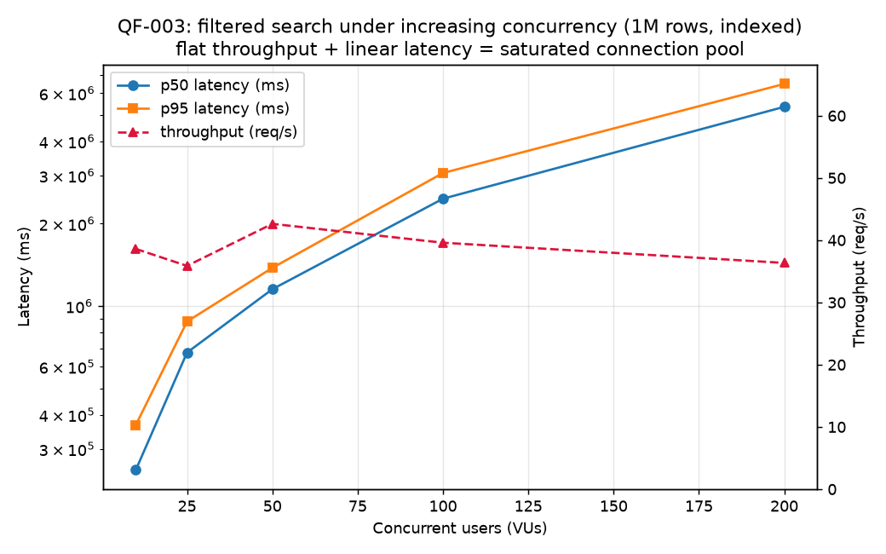

# QueryForge

[](https://github.com/Mr-Wolv/QueryForge_Bakr101_2026/actions/workflows/ci.yml)

**PostgreSQL Performance Engineering Service** — build it, measure it, find the bottleneck, fix it, prove it.

A small Spring Boot 3.5 / Java 25 REST service over a 1,000,000-row PostgreSQL product catalog,
used to run controlled, reproducible database performance experiments: filtered search, OFFSET vs
keyset pagination, and concurrency behavior — each documented with `EXPLAIN (ANALYZE, BUFFERS)`
before/after evidence.

## What was measured → what changed

| Question | Answer (1M rows, seed=42) |
| --- | --- |
| Baseline filtered search (10 req/s) | p95 **8.18 s** — Parallel Seq Scan, 911K rows filtered away per request |
| After one workload-shaped index | p95 **130 ms** (~63×), p50 **92 ms** (~40×), COUNT 79 ms → 11.4 ms (Index Only Scan) |
| OFFSET pagination, 50K rows deep | p50 **129 ms** |
| Keyset pagination, same depth | p50 **40 ms** — flat across depth |
| Concurrency ladder 10→200 VUs | Throughput plateaus at **~38 req/s** (10-connection pool — measured, not guessed) |
| Same code at 10K / 100K / 1M rows | p50 **9.9 ms → 37.2 ms → 3,687 ms** — small-scale numbers are not evidence |
| Point lookup floor (Workload A) | p50 **4.8 ms** at 1M rows via PK index |

Tradeoffs: index adds ~60 MB and write overhead; keyset cannot jump to arbitrary pages and carries
no total count. Full reasoning in [docs/conclusions.md](docs/conclusions.md).

## The headline graph


*Flat throughput with linearly growing latency = saturated connection pool —
the measured "what's next" answer, not a guess. More graphs in the experiment reports:
[QF-000](docs/experiments/QF-000-dataset-scaling.md) · [QF-002](docs/experiments/QF-002-pagination.md).*

## Quick start (reproduce everything)

Prereqs: Docker, JDK 25, Maven, Python 3, k6 (any install — see [scripts/README.md](scripts/README.md)).

```bash
docker compose up -d db          # Postgres 17 + pg_stat_statements (host port 5433)
./scripts/load-data.sh 1000000   # deterministic dataset (seed=42)
mvn spring-boot:run              # API on :8080
```

Try it:

```bash
curl "localhost:8080/api/products/1"
curl "localhost:8080/api/products?category=1&status=ACTIVE&minPrice=100&maxPrice=500&sort=createdAt&dir=desc&page=0&size=50"
curl "localhost:8080/api/products/keyset?category=1&status=ACTIVE&size=50"
```

Benchmarks (full QF-001/002/003 reproduction, from the repo root):

```bash
./scripts/benchmark.sh search RATE=10 DUR=60s OUT=qf001-baseline-search-1M-r10
./scripts/apply-index.sh
./scripts/benchmark.sh search RATE=10 DUR=60s OUT=qf001-indexed-search-1M-r10
./scripts/benchmark.sh pagination MODE=offset RATE=20 DUR=60s OUT=qf002-offset-1M
./scripts/benchmark.sh pagination MODE=keyset RATE=20 DUR=60s OUT=qf002-keyset-1M
./scripts/benchmark.sh concurrency VUS=100 DUR=45s OUT=qf003-vus100
```

Results land in `benchmark/results/*.json`; plans in `docs/experiments/plans/`.

A lightweight perf-regression check (NFR5) is included:

```bash
./scripts/perf-regression.sh        # fails if filtered-search p95 > 1000 ms (tunable)
```

## API

| Endpoint | Purpose |
| --- | --- |
| `GET /api/products/{id}` | point lookup (404 if missing) |
| `GET /api/products` | filtered search: `category, status, minPrice, maxPrice, sort(createdAt\|price\|id), dir, page, size≤200` |
| `GET /api/products/keyset` | cursor pagination: same filters + `cursor` + `size` |
| `GET /api/categories` | category list |

## Documentation map

- [docs/architecture.md](docs/architecture.md) — components and request paths
- [docs/benchmarks.md](docs/benchmarks.md) — experiment index, benchmark matrix, reproduction commands
- [docs/experiments/](docs/experiments/) — QF-000 (scaling), QF-001 (index), QF-002 (pagination), QF-003 (concurrency), raw plans
- [docs/conclusions.md](docs/conclusions.md) — engineering conclusions, tradeoffs, and the next justified levers

## Design principle

**Never optimize because you know the answer — optimize because the evidence says where the problem
is.** The baseline schema has zero secondary indexes; the composite index is a *measured* change
applied manually via `scripts/apply-index.sh`, never assumed.

## Test

```bash
mvn test        # unit + functional tests (PostgreSQL via Testcontainers, needs Docker)
```

> **Windows note:** if Testcontainers cannot reach Docker Desktop's named pipes from the Java
> client, run the functional suite against the compose database instead:
> `QF_DB_URL=jdbc:postgresql://localhost:5433/queryforge mvn test`
