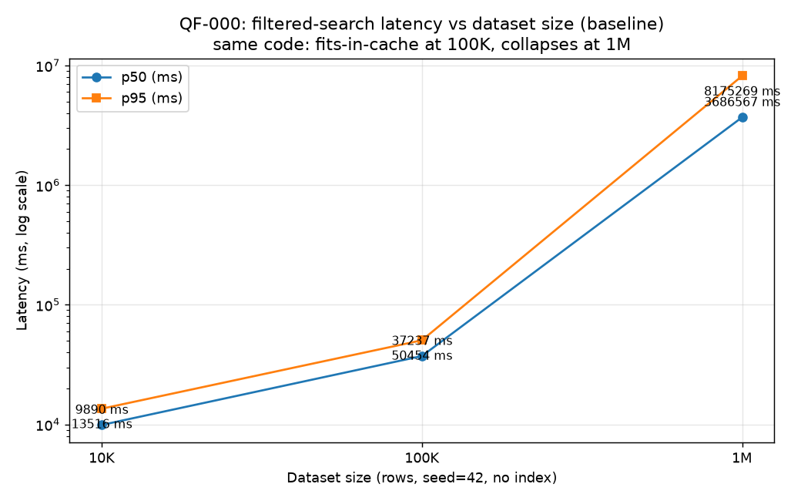

# QF-000 — Dataset scaling and point lookup (baseline behavior)

Two short experiments that frame everything else: how baseline latency scales with dataset size,
and where the floor is for a highly selective lookup.

## Part 1 — filtered search vs dataset size (baseline, no index)

Same workload as [QF-001](QF-001-baseline.md), schema has **no secondary indexes**, 10 req/s
constant arrival, 30 s per size, dataset regenerated from seed=42 for each size.

| Dataset | p50 | p95 | p99 | RPS |
| ---: | ---: | ---: | ---: | ---: |
| 10,000 rows | 9.9 ms | 13.5 ms | 17.1 ms | 10.0 |
| 100,000 rows | 37.2 ms | 50.5 ms | 84.8 ms | 10.0 |
| 1,000,000 rows | **3,687 ms** | **8,175 ms** | 8,927 ms | 8.6 |

**Observation.** The code is identical in all three runs — the 10K and 100K tables fit in
PostgreSQL's cache, so even a full seq scan per request stays in double-digit milliseconds. At 1M
rows (≈114 MB heap) the scan streams from disk under concurrent load and latency explodes ~100×.
This is the whole thesis of the project in one table: *small-scale behavior is not evidence about
large-scale behavior* — you have to measure at production-like volume.

## Part 2 — Workload A: point lookup (`GET /api/products/{id}`)

1M rows, indexed state, ids drawn from the whole keyspace, 10 req/s, 30 s.

| Metric | Value |
| --- | ---: |
| p50 | 4.8 ms |
| p95 | 8.0 ms |
| p99 | 65.9 ms |

**Observation.** The PK index keeps point lookups essentially flat and fast even at 1M rows —
this is the floor every other workload should be compared against, and it confirms the app/HTTP
overhead is ~5 ms, so virtually all of QF-001's baseline cost was database access-path work.

Raw metrics: [qf000-scaling-search-10K.json](../../benchmark/results/qf000-scaling-search-10K.json),
[qf000-scaling-search-100K.json](../../benchmark/results/qf000-scaling-search-100K.json),
[qf000a-point-lookup-1M.json](../../benchmark/results/qf000a-point-lookup-1M.json).
