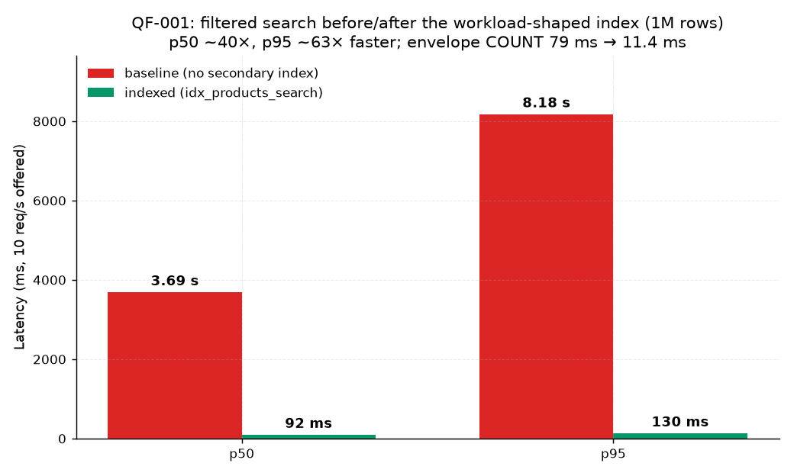

# QF-001 — Filtered product search: baseline vs composite index

**Scenario:** filtered product search — `GET /api/products?category=1&status=ACTIVE&minPrice=100&maxPrice=500&sort=createdAt&dir=desc&page=0..3&size=50`
**Dataset:** 1,000,000 rows (seed=42), table + indexes ≈ 135 MB, `created_at` spans 2024-01-01 → 2024-01-12.
**Filter selectivity:** 88,913 of 1,000,000 rows match (8.9%).
**Load shape:** constant arrival rate (k6), 60 s runs, page 0–3. Final suite captured on a warmed system;
all after-runs share the same cache conditions as the before-run, so deltas are comparable.

---

## Stage 0 — baseline (no secondary indexes)

Schema = [V1__create_products.sql](../../db/migrations/V1__create_products.sql): only the primary key exists.

| Offered rate | RPS achieved | p50 | p95 | p99 | Errors |
| ---: | ---: | ---: | ---: | ---: | ---: |
| 100 req/s (initial cold-cache run) | 7.9 | 26.0 s | 28.4 s | 28.9 s | 1 (pool timeout) |
| 30 req/s (initial cold-cache run) | ~14 | 19.0 s | 20.7 s | 21.1 s | 0 |
| 10 req/s (definitive warmed run) | 8.6 | **3.69 s** | **8.18 s** | 8.93 s | 0 |

The service collapses under even modest load. `EXPLAIN (ANALYZE, BUFFERS)` — full capture:
[qf001-baseline-explain.txt](plans/qf001-baseline-explain.txt)

```text
Limit (actual time=83.324..85.124 rows=50)
  Buffers: shared hit=2826 read=11784
  -> Gather Merge (2 workers)
       -> Sort (top-N heapsort, created_at DESC)
            -> Parallel Seq Scan on products
                 Filter: (price >= 100 AND price <= 500 AND category_id = 1 AND status = 'ACTIVE')
                 Rows Removed by Filter: 303696   (per worker; 911,075 total)
```

**Observation (why it was slow):**

1. Every request reads the whole 114 MB heap: **911 K of 1 M rows are read and discarded** by the filter.
2. The per-request Spring Data `count(*)` repeats the same seq scan (+79 ms, another full table pass).
3. Cost per request ≈ 2 × 114 MB ≈ 230 MB of reads; with a 10-connection pool this saturates disk
   bandwidth, so any offered rate above ~10 req/s turns into queueing (seconds of latency), and at
   100 req/s the pool itself times out. Uncontended single request: ~165 ms.

## Change

```sql
CREATE INDEX idx_products_search ON products (category_id, status, price, created_at DESC);
```

Column order rationale: equality columns first (`category_id`, `status`), then the range column
(`price`), then the sort column (`created_at DESC`) so equal-prefix rows come out pre-sorted.

## Result — after

`EXPLAIN (ANALYZE, BUFFERS)` — full capture: [qf001-indexed-explain.txt](plans/qf001-indexed-explain.txt)

```text
Limit (actual time=61.960..73.869 rows=50)
  Buffers: shared hit=14468 read=538
  -> Gather Merge
       -> Sort (top-N heapsort)
            -> Parallel Bitmap Heap Scan on products
                 Heap Blocks: exact=4294
                 -> Bitmap Index Scan on idx_products_search (rows=88913)
                      Buffers: shared hit=3 read=538
```

The COUNT side changed even more dramatically — from Parallel Seq Scan (79 ms) to:

```text
Index Only Scan using idx_products_search (actual time=0.062..8.183 rows=88913)
Execution Time: 11.416 ms
```

| Offered rate | RPS | p50 | p95 | p99 | Errors |
| ---: | ---: | ---: | ---: | ---: | ---: |
| 10 req/s | 10.0 | **92 ms** | **130 ms** | 151 ms | 0 |
| 30 req/s | 29.9 | 131 ms | 252 ms | 349 ms | 0 |

**Improvement at 10 req/s (definitive runs):** p50 **3.69 s → 92 ms (~40×)**, p95 **8.18 s → 130 ms (~63×)**.
The service went from "collapses at 30 req/s" to "sustains 30 req/s at p95 252 ms".
Latency at higher offered rates still grows once the 10-connection pool saturates — quantified in
[QF-003](QF-003-concurrency.md); that is now the next bottleneck, not the access path.



## Tradeoff

- Storage: +~60 MB for the index (table 114 MB → total ≈ 174 MB with index).
- Writes: every INSERT/UPDATE of filtered columns maintains 4 index columns; the workload here is
  read-mostly, so the cost is acceptable — but it is a real cost and would matter on a write-heavy
  catalog.
- The index is workload-specific: `sort=price` or name searches still scan. Deliberately not added —
  see conclusions.
