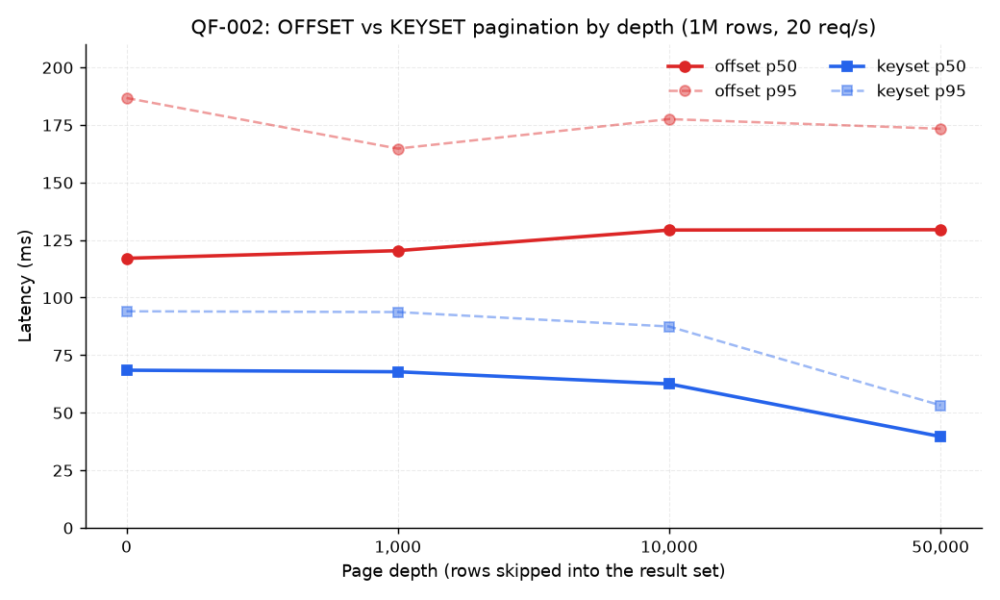

# QF-002 — OFFSET vs KEYSET pagination at increasing depth

**Workload:** same filter as QF-001, 50 rows/page, measured at result-set depths
0 / 1,000 / 10,000 / 50,000 rows. Keyset cursors are derived in `setup()` from the offset endpoint
so both strategies are measured at the exact same logical position in the result set.
**Dataset:** 1,000,000 rows (seed=42), **indexed state** (`idx_products_search` present).
**Load:** 20 req/s constant arrival, 60 s per mode.

## Implementation

- OFFSET: `GET /api/products?page=N&size=50` — Spring Data `Pageable` (LIMIT 51 + `count(*)`).
- KEYSET: `GET /api/products/keyset?cursor=...&size=50` —
  [ProductKeysetRepository](../../src/main/java/com/bakr/queryforge/repo/ProductKeysetRepository.java),
  opaque base64url cursor of `(created_at, id)`, predicate
  `created_at < :cv OR (created_at = :cv AND id < :cid)`, no COUNT, no OFFSET.
  Keyset is deliberately **`sort=createdAt`-only**: the cursor encodes `(created_at, id)`, so a cursor
  for another sort column would decode to the wrong type (other sorts remain on the offset endpoint;
  requests with `sort=price|id` are rejected with 400).

## Results (p50 / p95 per depth)

| Depth (rows skipped) | OFFSET p50 | OFFSET p95 | KEYSET p50 | KEYSET p95 |
| ---: | ---: | ---: | ---: | ---: |
| 0 | 117 ms | 187 ms | 68 ms | 94 ms |
| 1,000 | 120 ms | 165 ms | 68 ms | 94 ms |
| 10,000 | 129 ms | 178 ms | 62 ms | 87 ms |
| 50,000 | **129 ms** | 173 ms | **40 ms** | 53 ms |

Keyset latency is **flat across depth** (40–68 ms); OFFSET carries a roughly constant premium
(≈ 117–129 ms p50) composed of (a) the OFFSET skip itself and (b) the mandatory `count(*)`
Spring Data issues per page — 11.4 ms at this size that keyset never pays.

The signature OFFSET degradation (latency ∝ depth) is muted here because the index makes the
filter cheap enough that walking to the offset is fast; the COUNT elimination and the removed
OFFSET walk are the measurable wins (≈ 1.7–3.2× per page). The plans:

- Deep offset: [qf002-offset-deep-explain.txt](plans/qf002-offset-deep-explain.txt)
- Keyset at the same depth: [plans/qf002-keyset-baseline-explain.txt](plans/qf002-keyset-baseline-explain.txt)

## Why keyset wins

1. No `OFFSET`: the server stops after `size` rows past the cursor predicate instead of producing
   and discarding `depth` rows first — per-page work is bounded by the filter and the page size,
   not by how deep the page sits.
2. No COUNT: keyset pages don't know their total size, so the query never pays the per-page
   `count(*)` the Spring Data envelope issues (11.4 ms indexed at this size).
3. Deterministic order: `(created_at, id)` tiebreaking makes pages stable under concurrent inserts.

**What this does *not* prove:** with the filter-first index
`(category_id, status, price, created_at DESC)`, `created_at` sits *after* the `price` range column,
so the index cannot serve `ORDER BY created_at DESC` as a lossless walk — the captured keyset plan
([qf002-keyset-baseline-explain.txt](plans/qf002-keyset-baseline-explain.txt)) still scans the
qualifying rows and top-N sorts them. The measured 40 ms vs 129 ms is therefore attributable to the
removed OFFSET traversal and COUNT — **not** to a direct cursor seek. Whether an order-first index
`(category_id, status, created_at DESC, price)` would turn keyset into a true index walk (and what
it would cost the filter path) is tested in [QF-004](QF-004-index-ordering.md).

## Tradeoff

- Keyset only supports **next/previous relative to a cursor** — you cannot jump to page N.
- The cursor is opaque and encodes `(created_at, id)`; keyset is restricted to `sort=createdAt`
  (other sorts get a 400), and changing `dir` mid-walk invalidates the cursor.
- Total count (if UI needs it) must be fetched separately/cached.
