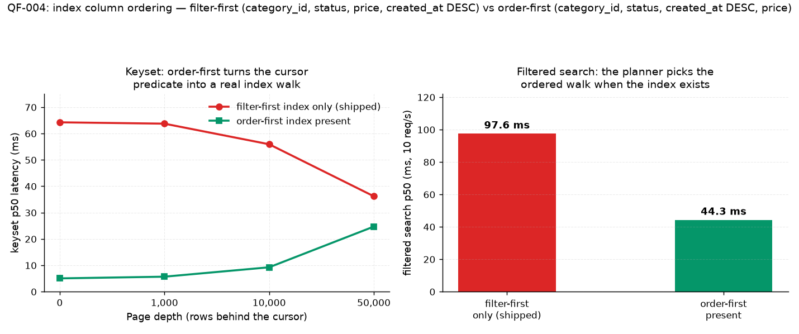

# QF-004 — Index column ordering: filter-first vs order-first

**Question:** the QF-001 index is `(category_id, status, price, created_at DESC)` — "filter-first"
(equality, then the `price` range, then the sort column). What happens if the sort column comes
*before* the range column — `(category_id, status, created_at DESC, price)` ("order-first")?
Does the keyset path become a true index walk, and what does that shape cost the filtered-search path?

**Why this experiment exists:** [QF-002](QF-002-pagination.md) showed keyset beating OFFSET
(40 ms vs 129 ms p50 at 50K depth) — but its "What this does *not* prove" note flags that with the
filter-first index, `created_at` sits *after* the `price` range column, so the keyset predicate
cannot seek; the plan still scans qualifying rows and top-N sorts them. This experiment closes
that gap: build the order-first candidate, measure both workloads under both index states, and
**decide whether to swap** — deliberately, not casually.

**Method:** same 1M-row dataset (seed=42), warmed, single session. The candidate was created and
dropped with `CREATE/DROP INDEX CONCURRENTLY` and is **not part of the shipped migrations** — the
baseline state after this experiment is exactly QF-001's state (`products_pkey` +
`idx_products_search` only), so the matrix above stays reproducible. Two same-session index states:

- **A (candidate):** both indexes present → planner free to choose per query.
- **B (shipped):** filter-first only → the QF-001/QF-002 reference state.

Keyset probes: `db/explain/qf004-keyset.sql` (depth-50K cursor literal
`2024-01-06T00:05:29Z / id 437129`, derived from the current dataset's k6 setup cursor — same
logical position both states). Narrow-filter probe: same filter with `price BETWEEN 499 AND 500`
(225 matching rows instead of 88,913).

## 1. Keyset path: order-first makes the cursor predicate real

| Index state | Plan for keyset @50K depth | DB time |
| --- | --- | ---: |
| B — filter-first only | Parallel Bitmap Heap Scan (88,913 rows) → top-N Sort → Limit | 118.6 ms |
| A — order-first present | **Index Scan reading exactly 51 rows** for `LIMIT 50` (Incremental Sort finishes at 50) | **30.3 ms** |

- Filter-first capture: [qf004-keyset-filter-first.txt](plans/qf004-keyset-filter-first.txt)
- Order-first capture: [qf004-keyset-order-first.txt](plans/qf004-keyset-order-first.txt)

Under order-first, the cursor predicate `created_at < :cv OR (= AND id < :cid)` plus
`ORDER BY created_at DESC, id DESC LIMIT 50` becomes a bounded index walk: the DB stops after
reading 51 rows instead of assembling and sorting all 89K qualifying rows first.

## 2. Filtered-search path: the planner quietly upgrades it too

With both indexes present, the planner **also picks the order-first index** for the plain
filtered search (`page 0..3`, QF-001 workload) — a pure ordered walk, no bitmap, no sort:

| State | Filtered search p50 / p95 (10 req/s, k6) | Plan |
| --- | --- | --- |
| A — both indexes | **44 ms / 87 ms** | ordered Index Scan ([qf004-search-both-indexes.txt](plans/qf004-search-both-indexes.txt)) |
| B — filter-first only | 98 ms / 164 ms | Bitmap + top-N Sort ([qf004-search-filter-first-only.txt](plans/qf004-search-filter-first-only.txt)) |

(Reference point: QF-001's indexed state measured p50 92 ms / p95 130 ms in its own session.)

## 3. The k6 A/B (same session, same cache conditions)

Keyset p50 by depth ([raw JSON](../../benchmark/results/)):

| Depth | A — order-first present | B — filter-first only |
| ---: | ---: | ---: |
| 0 | **5.0 ms** | 64.3 ms |
| 1,000 | **5.7 ms** | 63.7 ms |
| 10,000 | **9.2 ms** | 55.9 ms |
| 50,000 | **24.7 ms** | 36.2 ms |



Under order-first the shape inverts: latency grows with **distance behind the cursor** (the walk
length), not with result-set size — and every depth is still faster than filter-first's flat ~36–64 ms.
The near-flat filter-first line (36–64 ms across all depths) is the Bitmap+Sort cost, which barely
depends on depth — consistent with the QF-002 finding that its "flat" keyset is flat because of the
sort, not because of a seek.

## 4. The counter-case: narrow filters

The failure mode of order-first indexes is a narrow range column *after* the sort column: the
ordered walk can no longer apply `price` as a bound, so it must visit the whole
`(category_id = 1, status = 'ACTIVE')` prefix until it has 50 matching rows. With 225 matching
rows in the whole prefix, it still finds them in the first pages — the probe stays cheap
(**2.0 ms** DB time, [qf004-narrow-order-first-only.txt](plans/qf004-narrow-order-first-only.txt)).
The bound would only hurt if a prefix held very few matches, forcing a long scan before 50 rows
accumulate (or terminating with a wrong-looking short page — keyset next-pages would then still
be correct, but the first page would return fewer than `LIMIT` rows even though matches exist).

With both indexes present, the planner avoids even that residual risk: for the narrow probe it
**chooses the filter-first bitmap** (1.1 ms, [qf004-narrow-both-indexes.txt](plans/qf004-narrow-both-indexes.txt))
— per-query selection, exactly as designed.

## Decision — keep the filter-first index, document the tradeoff

The order-first index won every measured query on this dataset: keyset 30.3 vs 118.6 ms DB-side
(24.7 vs 36.2 ms p50 at 50K through the API), filtered search 44 vs 98 ms p50, and it degrades
gracefully on the narrow probe (2.0 ms). It would be a defensible swap.

It stays a *candidate* anyway, on explicit evidence-based grounds:

1. **The current numbers are already good.** The shipped state's worst case (36 ms p50 at 50K
   depth) is nowhere near a user-visible problem; QF-003's measured next bottleneck is the
   connection pool, not either index. Swapping now optimizes a non-bottleneck.
2. **The narrow-prefix risk is dataset-dependent.** The 225-row probe dodges it because the
   generator spreads prices uniformly; a price distribution with an empty-tail prefix could make
   the walk degenerate. That risk is unmeasured here and would need a targeted experiment.
3. **Write and storage cost.** A second 51 MB index (vs 64 MB for the shipped one) adds another
   structure every write maintains — on a read-mostly workload that is acceptable, but it buys
   latency the workload does not need yet.

**What would change the decision:** telemetry showing deep keyset walks or `sort=createdAt`
first-page traffic dominating, or a workload where OFFSET search at p50 ~100 ms actually matters.
The candidate DDL, ready to apply, is:

```sql
CREATE INDEX CONCURRENTLY idx_products_search_orderfirst
  ON products (category_id, status, created_at DESC, price);
```

## Tradeoffs (of the experiment itself)

- A/B was same-session but sequential; absolute numbers still carry the single-host caveat
  documented in [benchmarks.md](../benchmarks.md). Deltas within the session are the evidence.
- The narrow-filter probe demonstrates the mechanism (whole-prefix visit, no price bound on the
  walk) but not the pathological case; that case needs a prefix with almost no matches and was
  deliberately not synthesized.
